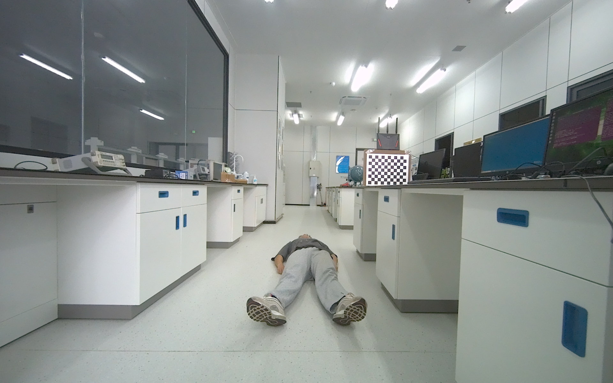
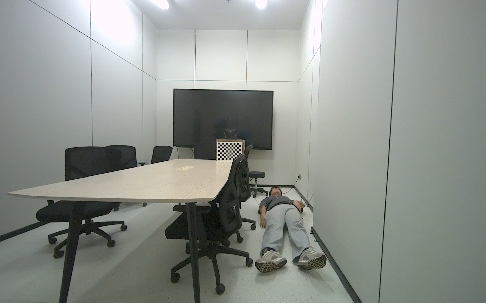

# RF-Avatar Dataset

Official dataset repository for **RF-Avatar: WiFi CSI and RGB-D Fusion for Multi-Person 3D Skeleton and Point Cloud Reconstruction**.

RF-Avatar is a synchronized multimodal human-sensing dataset designed for indoor, deployment-aware, multi-person 3D reconstruction. Each usable sample combines RGB-D observations, sanitized WiFi Channel State Information (CSI), and calibrated router geometry. BODY-38 skeletons and depth-observed human-centric point clouds are provided as supervision targets. The dataset supports one to three people per frame and includes both ordinary recordings and paired real physical-occlusion recordings.

The raw dataset is distributed through external storage because it is too large for a standard GitHub repository. This repository provides the download entry, representative images, dataset statistics, paper-ready tables, and reproducible analysis scripts.

## Highlights

- Synchronized **RGB, depth, WiFi CSI, and router geometry**.
- Per-person **BODY-38 3D skeleton** supervision.
- Depth-observed **human-centric point cloud pseudo-labels** for coarse surface reconstruction.
- Single-person and multi-person recordings with up to **three people per frame**.
- Multiple indoor scenes and router deployment configurations.
- A paired physical-occlusion subset covering **three occluder materials** and **three distances**.
- Session-level organization suitable for leakage-free train/validation/test splitting.

## Preview

| Lab scene | Room scene |
| --- | --- |
|  |  |

The preview images illustrate the visual collection environment. RGB-D, CSI, router geometry, BODY-38 labels, and point cloud pseudo-labels are synchronized in the processed dataset.

## Download

The latest public occlusion-free release is available through Quark Drive:

- **Download:** [RF-Avatar occlusion-free dataset](https://pan.quark.cn/s/ec0b5a6b0257)
- **Extraction code:** `RUQ4`
- **Release note:** data that were previously stored as a separate `new_data_row` collection have been merged into this latest occlusion-free release.

The statistics below describe the complete dataset analyzed in the manuscript, including the paired physical-occlusion subset. If the physical-occlusion files are distributed through a separate link, that download entry should be added to this section.

## Dataset Summary

The following statistics reproduce Table I of the current manuscript and are computed after synchronization and dataset quality control.

| Item | Value |
| --- | ---: |
| Subjects | 12 |
| Action categories | 30 |
| Recorded router deployment configurations | 9 |
| Human reconstruction router configurations | 5 |
| Recording sessions | 924 |
| Valid RGB-D frames | 11,331 |
| Valid CSI samples | 8,009 |
| Skeleton-valid frames | 6,987 |
| Point-cloud-supervised samples | 3,838 |
| Human instances | 9,160 |
| Maximum people per frame | 3 |
| Physical-occlusion paired samples | 1,980 |

The recordings span **three indoor scenes**. Among the nine recorded router configurations, five contain retained multimodal human reconstruction samples. One configuration is used for background/no-person calibration, while three additional recorded configurations currently contain no retained multimodal human samples under the applied filtering rules.

### Counting conventions

- A **frame** is counted once regardless of the number of people visible in it.
- A **human instance** is one valid person annotation in one frame. For example, one frame containing two people contributes one frame and two human instances.
- A **skeleton-valid frame** contains at least one valid BODY-38 skeleton. The people count is determined from valid BODY-38 instances rather than directory-level subject tokens.
- A **point-cloud-supervised sample** contains a retained depth-observed human-centric point cloud pseudo-label.
- RGB-D, CSI, skeleton, and point cloud counts describe modality-specific validity. They should not be interpreted as a single all-modality-valid sample count.
- Background labels such as `nothing` and `newlab_nothing` represent background/no-person calibration rather than human actions.

## Multi-Person Distribution

The distribution below is computed over the 6,987 skeleton-valid frames.

| Number of people | Frames | Human instances |
| --- | ---: | ---: |
| 1 person | 5,238 | 5,238 |
| 2 people | 1,325 | 2,650 |
| 3 people | 424 | 1,272 |
| **Total** | **6,987** | **9,160** |

## Action-Level Statistics

Raw action names are parsed from directory or metadata names. Some labels contain occlusion-related suffixes and are therefore kept separate from their proposed canonical actions. Background/no-person calibration labels are also retained for auditability.

<details>
<summary>Show all 30 parsed action categories</summary>

| Action | Sessions | Valid frames | Human instances |
| --- | ---: | ---: | ---: |
| `cross_2p_accel` | 12 | 50 | 100 |
| `cross_2p_accel2` | 12 | 49 | 98 |
| `cross_2p_const` | 12 | 49 | 98 |
| `cross_2p_const2` | 12 | 47 | 94 |
| `cross_3p_accel` | 2 | 6 | 18 |
| `cross_3p_accel2` | 2 | 7 | 21 |
| `cross_3p_const` | 2 | 11 | 33 |
| `cross_3p_const2` | 2 | 12 | 36 |
| `lie_down` | 43 | 315 | 446 |
| `newlab_nothing` | 1 | 0 | 0 |
| `nothing` | 4 | 0 | 0 |
| `occlusion_full` | 20 | 194 | 194 |
| `occlusion_lower` | 43 | 345 | 467 |
| `occlusion_upper` | 43 | 133 | 211 |
| `pick_up` | 70 | 566 | 741 |
| `sit_occlusion_full` | 27 | 243 | 243 |
| `sit_occlusion_lower` | 27 | 214 | 214 |
| `sit_still` | 43 | 402 | 593 |
| `sit_to_stand` | 70 | 613 | 801 |
| `squat` | 70 | 609 | 799 |
| `stand_occlusion_full` | 27 | 292 | 292 |
| `stand_occlusion_lower` | 27 | 231 | 231 |
| `stand_occlusion_upper` | 27 | 185 | 185 |
| `stand_still` | 43 | 390 | 551 |
| `walk_away_accel` | 42 | 231 | 322 |
| `walk_away_const` | 42 | 259 | 336 |
| `walk_towards_accel` | 43 | 280 | 381 |
| `walk_towards_const` | 43 | 265 | 359 |
| `wave` | 70 | 616 | 772 |
| `work_side` | 43 | 373 | 524 |

</details>

Machine-readable action statistics, including subject, scene, router-configuration, and subset coverage, are available in [`dataset_stats/action_stats.csv`](dataset_stats/action_stats.csv).

## Physical-Occlusion Subset

Real physical occlusion changes both RGB-D visibility and RF propagation. RF-Avatar therefore uses paired recordings in which each occluded RGB-D/CSI observation is aligned with a corresponding unoccluded track. Valid pairs are selected after quality control.

| Occluder | Distance | Sessions | Raw pairs | Valid pairs | Discarded pairs |
| --- | ---: | ---: | ---: | ---: | ---: |
| Black cloth | 100 cm | 28 | 401 | 255 | 146 |
| Black cloth | 150 cm | 27 | 377 | 160 | 217 |
| Black cloth | 200 cm | 27 | 380 | 123 | 257 |
| Cardboard board | 100 cm | 27 | 365 | 197 | 168 |
| Cardboard board | 150 cm | 27 | 362 | 130 | 232 |
| Cardboard board | 200 cm | 27 | 363 | 181 | 182 |
| Foam board | 100 cm | 27 | 364 | 348 | 16 |
| Foam board | 150 cm | 27 | 370 | 326 | 44 |
| Foam board | 200 cm | 27 | 362 | 260 | 102 |
| **Total** | - | **244** | **3,344** | **1,980** | **1,364** |

## Modalities and Supervision

| Component | Role | Description |
| --- | --- | --- |
| RGB | Model input | Color observation from the ZED-X stereo camera |
| Depth | Model input | Depth map aligned with the RGB observation |
| WiFi CSI | Model input | Sanitized amplitude and phase features over time and subcarriers |
| Router geometry | Model input | Receiver/camera origin and calibrated transmitter offset |
| BODY-38 skeleton | Training and evaluation target | Per-person 3D skeleton with 38 joints |
| Human-centric point cloud | Training and evaluation pseudo-label | Depth-observed visible human geometry filtered using BODY-38 supervision |

BODY-38 skeletons and point cloud pseudo-labels are supervision targets and are not inference inputs.

### Router coordinate system

The WiFi receiver is co-located with the ZED-X camera optical center and is defined as the camera-coordinate origin:

```text
Rx = camera origin = (0, 0, 0)
Tx = manually measured 3D offset relative to Rx/camera origin
```

Because the receiver and stereo-camera optical center are aligned, the receiver coordinate is not separately stored in every metadata record. A transmitter offset such as `tx_antenna_offset_mm` fully represents the calibrated transmitter position relative to the receiver/camera origin.

## Synthetic Visual Occlusion

Synthetic visual occlusion is **not an independently collected dataset**. During training, online random CutOut is applied to RGB and depth with probability `0.6`. The masked area covers `15%` to `50%` of the image, the aspect ratio is sampled from `0.3` to `3.3`, and masked values are set to `0.0`. CSI remains unchanged.

For the synthetic stress test, the lower `50%` of each RGB-D observation is masked while the original CSI is preserved. This procedure simulates visual missingness only; it does not reproduce RF propagation shifts caused by real physical occluders.

## Repository Contents

```text
RF-Avatar-dataset/
|-- README.md
|-- assets/                 # Preview images used on this page
|-- dataset_stats/          # JSON, Markdown, and CSV statistics
|-- paper_tables/           # Paper-ready Markdown and LaTeX tables
`-- scripts/                # Reusable dataset analysis scripts
```

Important statistics files include:

- `dataset_stats/dataset_summary.json`: complete machine-readable summary.
- `dataset_stats/action_stats.csv`: per-action sessions, frames, and human instances.
- `dataset_stats/people_distribution.csv`: one-, two-, and three-person distribution.
- `dataset_stats/scene_router_stats.csv`: scene and router-position statistics.
- `dataset_stats/physical_occlusion_stats.csv`: paired physical-occlusion statistics.
- `paper_tables/paper_dataset_tables.tex`: paper-ready LaTeX tables.

## Reproducing the Statistics

The analysis script scans metadata and file paths without loading the full image, CSI, or point cloud collection into memory:

```bash
python scripts/analyze_dataset_stats.py \
  --data-root "/path/to/RF-Avatar" \
  --output-dir "./dataset_stats"
```

Statistics are derived from the current filesystem organization because no project-specific `RFAvatarDataset` loader was present during the latest scan. Use session-level train/validation/test splits to avoid temporal leakage between consecutive frames from the same recording.

## Citation

If you use this dataset, please cite the RF-Avatar manuscript:

> Hongfei Wang, Yixuan Xu, Bo Cai, Zhuang Zhou, Ran Tao, and Haijun Xie, "RF-Avatar: WiFi CSI and RGB-D Fusion for Multi-Person 3D Skeleton and Point Cloud Reconstruction."

The final BibTeX entry and publication identifier will be added after publication.

## License and Contact

Dataset access and reuse terms should be checked before redistribution. A formal dataset license and maintainer contact should be added to this repository before the public release is announced.
